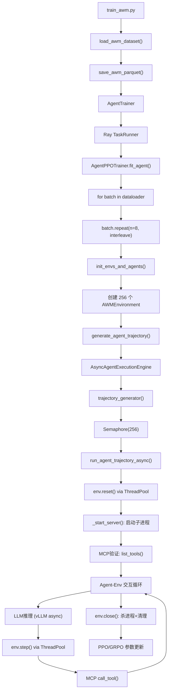
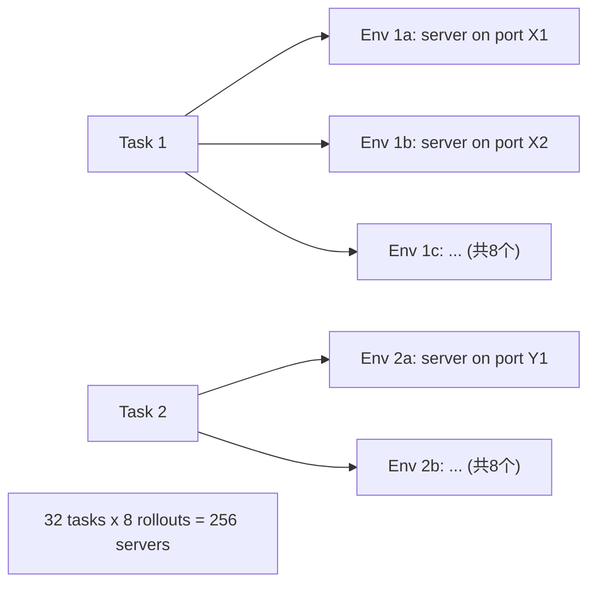

# AWM Agentic RL 训练效率分析

## 当前架构概览




## 训练数据流

```
load_awm_dataset() → List[{prompt, extra_info, data_source}]
  → save_awm_parquet() → parquet 文件
  → RLHFDataset.__getitem__() → row_dict (含 extra_info)
  → collate_fn() → DataProto.non_tensor_batch["extra_info"]
  → batch.repeat(n=8) → 256 个样本 (32 unique tasks x 8 rollouts)
  → init_envs_and_agents() → 256 个 AWMEnvironment 实例
  → AWMEnvironment.from_dict({**extra_info, **base_env_args})
```

---

## 严重问题 (Critical)

### 问题 1: `_settings_lock` 全局锁导致所有 MCP 操作完全串行化

**严重程度: 致命**

`[_ThreadSafeMCPExecutor](rllm/environments/awm/awm_env.py)` 使用了一个**类级别的 `threading.Lock()**`:

```80:80:rllm/environments/awm/awm_env.py
    _settings_lock = threading.Lock()
```

`list_tools()` 和 `call_tool()` 都在这个锁内执行完整的 MCP 连接生命周期：

```160:181:rllm/environments/awm/awm_env.py
        with self._settings_lock:
            with isolated_mcp_env():
                app = MCPApp(name="awm_agent", settings=self._build_settings())
                with contextlib.redirect_stderr(io.StringIO()):
                    async with app.run():
                        agent = Agent(...)
                        async with agent:
                            result = await asyncio.wait_for(
                                agent.list_tools(), timeout=self.timeout
                            )
                            ...
```

**后果**:

- 256 个环境的 MCP 验证（`_start_server` step 7）全部串行
- 训练中所有 tool call 全部串行：256 trajectories x ~~10 steps = **~~2560 次 MCP 调用全部排队**
- 假设每次 MCP 调用 2-5 秒 → 单个 batch 的 MCP 总耗时 **1.4-3.5 小时**
- 这完全抵消了并行 rollout 的意义

**根因**: `isolated_mcp_env()` 修改全局 `os.environ`，不安全 → 加锁。但锁的粒度太粗，导致所有实例串行。

**建议方案**: 

- 方案 A: 将 MCP 连接改为使用 HTTP 直接调用（绕过 mcp_agent 库），避免需要 `isolated_mcp_env()`
- 方案 B: 每个实例使用独立的进程（ProcessPoolExecutor）而不是线程，避免 env 污染
- 方案 C: 将 `_settings_lock` 改为实例级别，同时在 `_build_settings()` 中不依赖 `isolated_mcp_env()`

### 问题 2: 每次 MCP 调用都重建完整连接

**严重程度: 高**

每次 `list_tools()` / `call_tool()` 都执行：

1. `isolated_mcp_env()` → 修改环境变量
2. `_build_settings()` → 创建新的 Settings 对象
3. `MCPApp(...)` → 创建新的应用
4. `app.run()` → 启动应用上下文
5. `Agent(...)` → 创建新的 Agent
6. MCP 握手（SSE GET → POST initialize）
7. 执行实际调用
8. 清理所有资源

一个完整 trajectory（~10 步）需要重复这个过程 ~10+ 次。**没有连接复用。**

**建议**: 维持 MCP 连接池，每个 server 只建立一次连接，在整个 trajectory 期间复用。

### 问题 3: GRPO n=8 导致同一 task 创建 8 个独立 server

**严重程度: 高**




GRPO 中 `batch.repeat(n=8)` 将 32 个 task 复制 8 次 → 256 个样本 → 256 个独立的 AWM server 子进程。同一个 task 的 8 个 rollout 可以共享一个 server（只需在 `reset()` 时重置数据库），但当前实现没有利用这一点。

**建议**: 实现 server 池化，同一 scenario 的多个 rollout 共享一个 AWM server 实例，仅重置 DB 状态。

---

## 重要问题 (High)

### 问题 4: 资源消耗 — 256 个并发子进程

每个 batch 启动 256 个 Python 子进程（FastAPI + uvicorn + MCP），每个约 100-200MB 内存：

- **内存**: 25-50GB 仅用于 AWM server 子进程
- **文件描述符**: 256 个进程 + 256 个 socket + 256 个日志文件 → 可能超过 ulimit
- **端口**: 256 个并发端口（虽有重试机制，但仍有风险）
- **CPU**: 256 个 Python 进程与训练争抢 CPU

**建议**: 

- 减小 `n_parallel_agents`（如设为 32-64），牺牲一些并行度换取资源稳定性
- 实现 server 池化以减少总进程数

### 问题 5: AWM Server 启动耗时

`_start_server()` 包含多个阻塞等待：

- Step 5: `time.sleep(initial_wait)` = 3-10 秒
- Step 6: `_wait_for_server_ready()` 最多等 120 秒
- Step 7: MCP 验证（受 `_settings_lock` 串行化）
- 重试最多 3 次

256 个 server 启动即使完全并行也需要至少 30-60 秒，加上 MCP 串行验证可能需要数十分钟。

### 问题 6: `env.reset()` 中的 `_cleanup_server()` + `_start_server()` 全流程

每次 `reset()` 调用：

1. 杀掉旧 server 进程
2. 删除临时目录
3. 重新创建临时目录
4. 重新创建/复制数据库
5. 重新启动 server 子进程
6. 重新等待就绪
7. 重新验证 MCP

即使在推理脚本中这是必要的，但在训练中（每个 env 只用一次然后 close），这意味着**每个 trajectory 都承担完整的 server 生命周期开销**。

### 问题 7: ThreadPoolExecutor 每 batch 重建

```python
# trajectory_generator() 末尾:
self.executor.shutdown(wait=False, cancel_futures=True)
```

每个 batch 结束后 executor 被关闭，下个 batch 重新创建。增加了不必要的线程池启停开销。

---

## 中等问题 (Medium)

### 问题 8: Task-Level Config 未传递

AWMEnvironment 的 `reset()` 返回的 `info` 中没有 `task_max_prompt_length` / `task_max_response_length`：

```985:997:rllm/environments/awm/awm_env.py
        info = {
            "scenario": self.scenario_name,
            "task": self.task_description,
            "max_steps": self.max_steps,
        }
```

而 engine 期望的 key 是 `task_max_steps`（不是 `max_steps`）：

```python
task_max_steps = info.get("task_max_steps", max_steps)
```

这意味着 **AWM 环境设置的 max_steps 不会被 engine 读取**，engine 使用的是全局配置。虽然 shell 脚本中全局设置了 `rllm.agent.max_steps=30`，但这是一个潜在的不一致。

**建议**: 在 `reset()` 的 `info` 中添加 `task_max_steps`、`task_max_prompt_length`、`task_max_response_length`。

### 问题 9: `_run_async()` 每次创建新事件循环

```1082:1089:rllm/environments/awm/awm_env.py
    def _run_async(self, coro, timeout: float = 120.0):
        return asyncio.run(coro)
```

每次 MCP 调用都通过 `asyncio.run()` 创建一个全新的事件循环。对于高频调用（每个 trajectory ~10 次），事件循环的创建/销毁开销会累积。

### 问题 10: 奖励函数每次实例化

```python
# rllm/rewards/reward_fn.py:
def awm_reward_fn(task_info, action):
    reward_fn = AWMMCPPureCodeRewardFn(reward_config)  # 每次创建新实例
    return reward_fn(task_info, action)
```

虽然开销不大，但不必要的重复实例化。

### 问题 11: `extra_info` 在 parquet 中可能序列化为字符串

HuggingFace Dataset 保存 parquet 时，嵌套 dict 可能被序列化为 JSON string。`RLHFDataset.__getitem__()` 中：

```python
index = row_dict.get("extra_info", {}).get("index", 0)
```

如果 `extra_info` 是 string，`.get("index")` 会报错。虽然 `init_envs_and_agents` 有 JSON 解析保护，但 `__getitem__` 中可能出问题。

---

## 低等问题 (Low)

### 问题 12: 诊断代码开销

`_get_diagnostic_info()` 读取 dmesg、cgroup 信息等系统调用。仅在 error 时触发，但如果大量 server 启动失败，会显著增加延迟。

### 问题 13: `init_envs_and_agents` 中的 `from_dict()` 不启动 server

`from_dict()` 只创建 AWMEnvironment 对象，server 在 `reset()` 中才启动。这意味着 256 个环境的创建是轻量的，但 server 启动延迟全部集中在 trajectory 开始时。考虑预启动 server 可以减少 trajectory 等待时间。

---

## 效率影响量化估算


| 环节                     | 单次耗时   | 每 batch 次数 | 串行/并行                     | 每 batch 总耗时估算               |
| ---------------------- | ------ | ---------- | ------------------------- | --------------------------- |
| Server 启动 (步骤 3-6)     | 10-30s | 256        | 并行(受线程池限制)                | 30-120s                     |
| MCP 验证 (步骤 7)          | 2-5s   | 256        | **串行** (`_settings_lock`) | **8-21 min**                |
| Agent-Env 交互中 MCP call | 2-5s   | ~2560      | **串行** (`_settings_lock`) | **1.4-3.5 h**               |
| LLM 推理                 | 变化     | ~2560      | 并行(vLLM async)            | 取决于 GPU                     |
| Server 关闭+清理           | 1-3s   | 256        | 并行                        | 10-30s                      |
| **单 batch 总计**         |        |            |                           | **约 2-4 小时** (主要由 MCP 串行决定) |


---

## 优先级排序的优化建议

1. **[P0] 消除 `_settings_lock` 全局串行瓶颈** — 使用 HTTP 直接调用 MCP server 或改为实例级并发
2. **[P0] 实现 MCP 连接复用** — 每个 trajectory 只建立一次 MCP 连接
3. **[P1] 实现 AWM Server 池化** — 同一 scenario 共享 server，GRPO n=8 只需 32 个 server 而非 256 个
4. **[P1] 控制并发数** — 合理设置 `n_parallel_agents`，避免资源耗尽
5. **[P2] 修复 `info` 中的 key 名称** — `max_steps` → `task_max_steps`，补充 prompt/response length
6. **[P2] 预启动 server** — 在 `from_dict()` 或 `init_envs_and_agents` 阶段预热 server
7. **[P3] 复用 ThreadPoolExecutor** — 跨 batch 保持线程池

